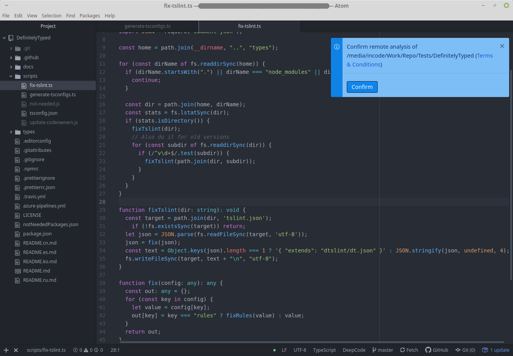
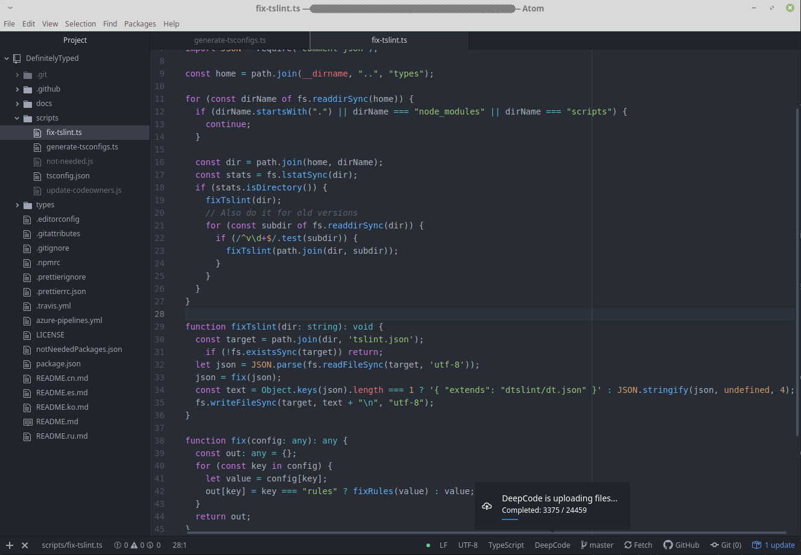
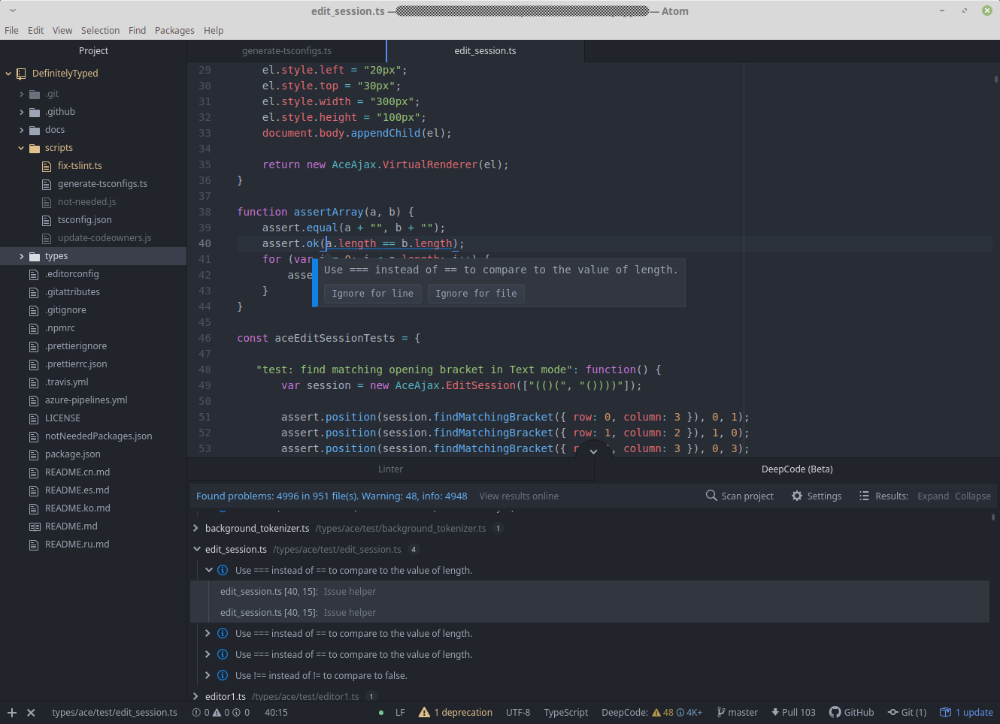
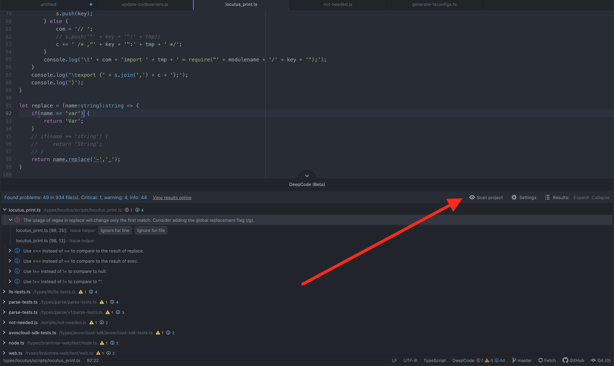
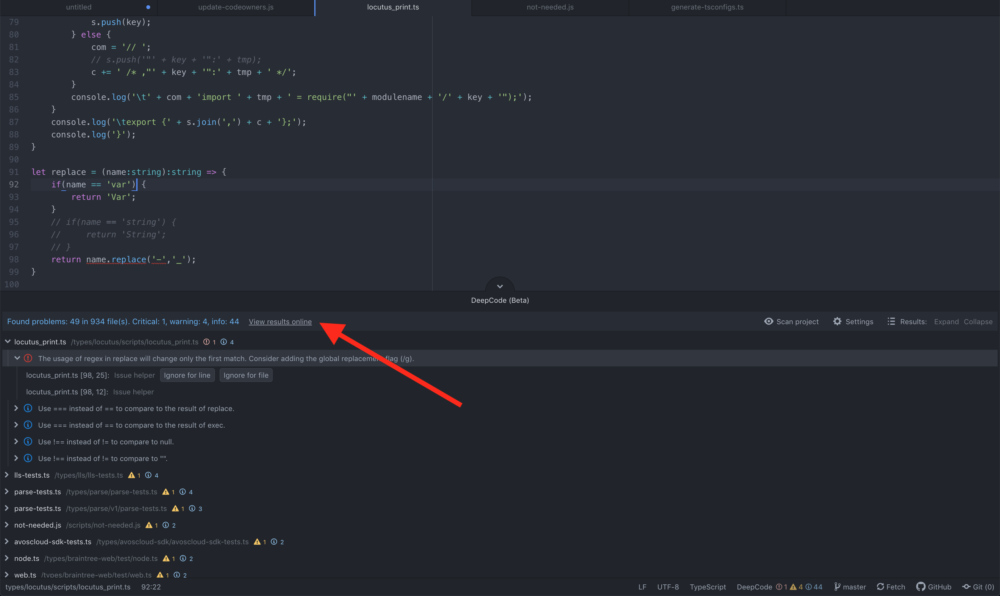
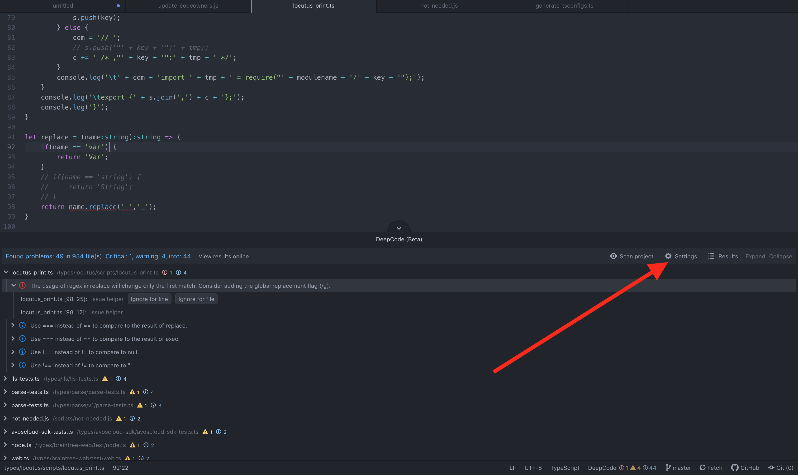

# DeepCode package for Atom

> Package is still under active development.

**The Atom package provided by <a href="https://www.deepcode.ai/">DeepCode.ai</a> finds bugs and critical vulnerabilities in your code. We support Java, Python, JavaScript, TypeScript and XML.**

# Table of Contents

1. [DeepCode package - what is it?](#deepcode-package)
2. [Installation](#installation)
   1. [Video on how to install the package](#video-on-how-to-install-the-package)
3. [How to use it?](#how-to-use-it)
   1. [PROTIP: DeepCode analysis on Save](#protip---deepcode-analysis-on-save)
   2. [Video on how to use the package](#video-on-how-to-use-the-package)
      1. [Tips on project onboarding](#tips-on-project-onboarding)
   3. [How to ignore suggestions (text)](#how-to-ignore-suggestions-text)
   4. [How to ignore suggestions (video)](#how-to-ignore-suggestions-video)
   5. [.dcignore file](#dcignore-file)
   6. [Rescan](#rescan)
   7. [View results online](#view-results-online)
   8. [Configuration](#configuration)
4. [Feedback and contact](#feedback-and-contact)

# DeepCode package

Through the package you can quickly start using DeepCode's code review and analysis within your development workflow. The package will automatically alert you about critical vulnerabilities you need to solve in your code the moment when you hit Save in your IDE. With DeepCode's superior code review you save time finding and fixing bugs before they go to production. 

## DeepCode's AI Engine finds bugs

DeepCode uses symbolic AI to process hundreds of millions of commits in open source software projects and learns how to find serious coding issues. Because the platform determines the intent of the code — and not only the syntax mistakes — DeepCode identifies 10x more critical bugs and security vulnerabilities than other tools. 

## Our AI provides explanation behind found bugs

In order to show detailed explanation why something was flagged as bug we introduced a new AI technique called Ontology. With Ontology, we’ve integrated the capability to present logical conclusions within the DeepCode engine. 

## Supported languages

Java, JavaScript, Python, TypeScript and XML are currently supported. C/C++ support is coming very soon.

# Installation

## Video on how to install the package

- We've prepared a short video on how to install the package. Head over to youtube to quickly get the package up and running:

   <a href="https://www.youtube.com/watch?v=TODO&utm_source=atom-package-readme" target="_blank"></a>

# How to use it?

## PROTIP - DeepCode analysis on Save

- DeepCode's package runs automatically when you [hit Save](https://flight-manual.atom.io/getting-started/sections/atom-basics/#editing-and-saving-a-file) (or the keyboard shortcut).
- If you don't like to save while working we strongly recommend to [install the autosave package](https://atom.io/packages/autosave).

## Video on how to use the package

- Here is a video on how to use the package. In short - don't forget to save and you would be in good hands:

   <a href="https://www.youtube.com/watch?v=TODO&utm_source=atom-package -readme" target="_blank"></a>

### Tips on project onboarding

- we are serious when it comes to your code. We upload and analyse your code only after you giving us the consent to do so. Your code is protected and used only for the purpose of
informing you about issues in code:

   

- once the confirmation is in place we start uploading the files:

   

## How to ignore suggestions (text)

There are two key steps here:
    
   1. Ignore particular alert directly by using `Ignore for line` or `Ignore for file`:

      

   2. Deepcode will create a comment, that will inform our analysis engine to ignore it. Don't forget to specify a description why you think it needs to be ignored. Your feedback will improve our engine over time:

## How to ignore suggestions (video)

- If the above information is not enough and want to see it in action, here is a video:

   <a href="https://www.youtube.com/watch?v=TODO&utm_source=atom-package-readme" target="_blank"></a>

## .dcignore file 

- If you want to ignore certain files/folders (like node_modules for example), create a .dcignore file. You can create it in any folder on any level starting from the directory where your project resides. You may create multiple `.dcignore` files depending on your use case. This file supports [glob syntax](https://en.wikipedia.org/wiki/Glob_(programming)) with "*" and "**" to specify file masks and sub-folders:

   ```
   .node_modules
   mocked_for_tests
   **/models/*_molecule.js
   ```

## Rescan

- If you need to restart the analysis or it fails for any reason, you can easily analyse the project again by clicking `Scan project`:

   

## View results online

- If you need to view the results online or you want to see example fixes, you could go to the analysis by clicking `View results online`:

   

## Configuration

- If you need to update the url to the DeepCode server in a self-managed environment or restart the login process, you could do so by clicking on `Settings`:

   

# Feedback and contact

- In case you need to contact us or provide feedback, we would love to hear from you - [here is how to get in touch with us](https://www.deepcode.ai/feedback).
- If you need to update this file, you can do so by [editing this README.md](https://github.com/DeepCodeAI/atom-plugin/edit/master/README.md).
