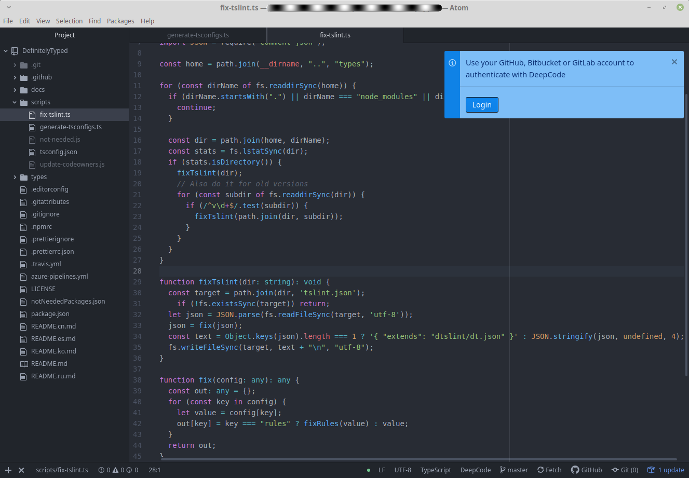

# DeepCode package for Atom

> Package is still in active phase of development

Atom package provided by <a href="https://www.deepcode.ai/">DeepCode.ai</a> to detect important bugs and issues
in your code. Supports Java, Python, JavaScript, TypeScript and XML.

DeepCode's AI algorithms continuously learn from bugs and issues fixed on open source
repos. The extension will automatically alert you about critical vulnerabilities you need to solve
in your code every time you save a file. Don't let security bugs go to production. Save time
finding and fixing them.

# How it works

Login Deepcode extension using your GitHub, BitBucket or GitLab account:



Confirm uploading your code to DeepCode server. Your code is protected and used only for the purpose of
informing you about issues in code:


DeepCode extension analyses code on saving files:


Inspect all found issues using "Problems" tab and syntax highlight:


# Development

For development purposes you will need to install Atom from official website: [atom.io](https://atom.io/).

Clone this repository:
```shell script
$ git clone https://github.com/DeepCodeAI/atom-plugin.git
```

Install npm dependencies:
```shell script
$ npm install
```

Go to the folder with cloned project and create symlink for plugin:
```shell script
$ cd atom-plugin
$ apm link
```

> Read more about [Atom Package Manager](https://flight-manual.atom.io/using-atom/sections/atom-packages/#command-line)

After that you can open any project in Atom and use package `DeepCode`.

To remove plugin type:
```shell script
$ cd atom-plugin
$ apm unlink
```
